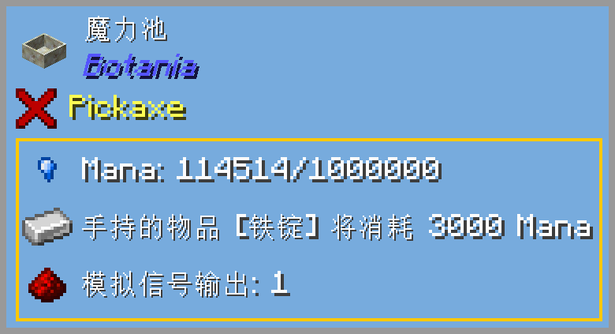
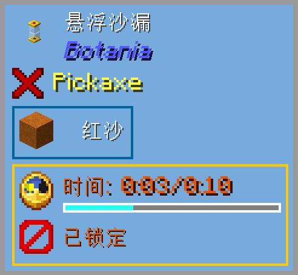
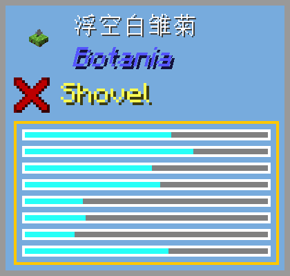
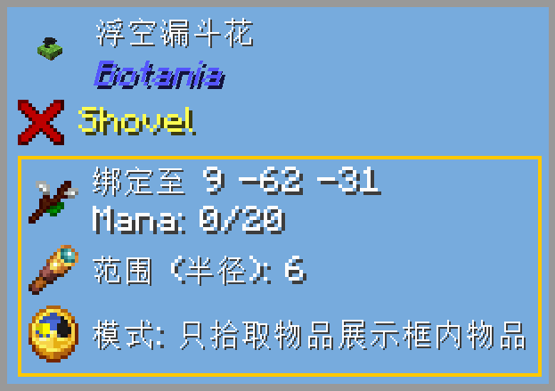

[English](./README_EN.md)

# BotanicProbe

### 概述
为你的 [Botania](https://www.curseforge.com/minecraft/mc-mods/botania) 和 [BotanicalMachinery](https://www.curseforge.com/minecraft/mc-mods/botanical-machinery) 添加 [TOP](https://www.curseforge.com/minecraft/mc-mods/the-one-probe) 支持，例如魔力显示、合成进度和工作状态。（有一些信息需要按住 Shift 才能显示） 
在为你提供大量量化信息的同时，也在一定程度上减少了 Botania 原本应有的乐趣，就如同 BotanicalMachinery 方便你的自动化一样。 
所以，如果你欣赏 Botania 独特的设计理念的话，请不要安装这个模组！

### 鸣谢
灵感来自：[TOP Community Edition](https://github.com/ukmojb/The-One-Probe-Community-Edition/tree/main/src/main/java/mcjty/theoneprobe/mods/botania), [Extra Botany](https://github.com/ExtraMeteorP/Extra-Botany/tree/master/src/main/java/com/meteor/extrabotany/client/integration/theoneprobe), [KJS Tricks](https://www.mcmod.cn/post/3406.html) 
风格灵感来自：[EioBox](https://github.com/SleepyTrousers/EnderIO-1.5-1.12/blob/master/enderio-base/src/main/java/crazypants/enderio/base/integration/top/TOPCompatibility.java) 
了不起的模组：[Botania](https://github.com/VazkiiMods/Botania), [TheOneProbe](https://github.com/McJtyMods/TheOneProbe)

### 画廊

### 编译
- 克隆本仓库。
- 打开命令行并定位到仓库目录。
- 运行 `gradlew build` 来编译模组。
- 编译好的模组生成在 `build/libs`。